# Network Security ML Pipeline

**Near-Real-Time Network Flow Threat Detection with Explainable AI**

98.3% F1-score on malicious traffic detection using XGBoost | Automated CI/CD Pipeline | Real-time Explainability via SHAP.

---

## 1. Introduction

Network Security ML Pipeline is an end-to-end machine learning system that classifies network flow records as benign or malicious. The project covers the complete MLOps lifecycle — ingesting raw traffic data into MongoDB Atlas, validating and transforming it, training and comparing three classification models with hyperparameter tuning, tracking every experiment in MLflow, and deploying the final model as a containerized FastAPI service through an automated CI/CD pipeline on AWS. A core focus of this project is explainability: rather than returning a binary verdict, the deployed model uses SHAP to surface the specific features driving each threat classification, making the system's decisions auditable rather than opaque.

By automating detection across 9 distinct attack types and pairing every flagged threat with an explainable, feature-level justification, this pipeline is designed to shorten the time a security analyst spends manually investigating *why* an alert fired — turning a black-box flag into an immediately actionable signal.

---

## 2. Dataset

The model is trained on **CICIDS 2017**, a network intrusion dataset published by the Canadian Institute for Cybersecurity. The dataset consists of labeled network flow records captured over multiple days, with each record summarizing a single connection through features such as flow duration, packet counts, byte rates, and inter-arrival times rather than raw packet contents. For this project, three source files were selected to maximize attack-type diversity while staying within MongoDB Atlas's free-tier storage limit, and ten features were retained based on their predictive contribution to binary classification.

| Source File | Attack Types Covered | Records Used |
|---|---|---|
| Wednesday-workinghours.pcap_ISCX | DoS GoldenEye, DoS Hulk, DoS Slowhttptest, DoS Slowloris, Heartbleed | 277,081 |
| Friday Afternoon (DDoS) | DDoS | 90,298 |
| Thursday Morning (Web Attacks) | Brute Force, XSS, SQL Injection | 68,146 |
| **Total** | **9 distinct attack types** | **435,525** |

---

## 3. Objectives

- To build an automated ETL pipeline that ingests, cleans, and stores large-scale network traffic data in MongoDB Atlas.
- To design a validated, leakage-free preprocessing pipeline that handles missing values, outliers, and class imbalance.
- To train and compare multiple classification models through a champion-challenger evaluation, selecting the best performer using F1-score and Recall rather than accuracy.
- To implement SHAP-based explainability so every threat classification is accompanied by the specific features that drove the decision.
- To deploy the trained model as a live API through a fully automated CI/CD pipeline on AWS, requiring no manual intervention after each code change.

---

## 4. Tech Tool Stack

| Layer | Tools / Technologies |
|---|---|
| Language | Python 3.10 |
| Data Storage | MongoDB Atlas |
| Data Processing | pandas, NumPy, scikit-learn (SimpleImputer, RobustScaler), imbalanced-learn (SMOTE) |
| Modeling | Logistic Regression, Random Forest, XGBoost (scikit-learn, XGBoost) |
| Hyperparameter Tuning | GridSearchCV |
| Explainability | SHAP (TreeExplainer, LinearExplainer) |
| Experiment Tracking | MLflow, hosted via DagsHub |
| API Framework | FastAPI, Pydantic, Uvicorn |
| Containerization | Docker |
| CI/CD | GitHub Actions |
| Cloud Infrastructure | AWS S3, AWS ECR, AWS EC2, IAM Roles |

---

## 5. Methodology

```
 CICIDS 2017 CSVs
        │
        ▼
 MongoDB Atlas  ──────────────►  Data Ingestion
                                 (stratified train/test split,
                                  preserving the benign/attack ratio
                                  across both sets)
                                          │
                                          ▼
                                 Data Validation
                                 (schema check, KS drift test between
                                  the stratified train and test sets)
                                          │
                                          ▼
                                 Data Transformation
                                 (SimpleImputer → RobustScaler → SMOTE)
                                          │
                                          ▼
                                 Model Trainer
                                 (Logistic Regression / Random Forest / XGBoost
                                  + GridSearchCV, logged to MLflow)
                                          │
                                          ▼
                                 Model Evaluation
                                 (Champion-Challenger evaluation: SHAP explainer
                                  selection, new model promoted only if it beats
                                  the current champion's F1-score)
                                          │
                                          ▼
                                 Model Pusher  ──────────►  AWS S3
                                          │
                                          ▼
                                 GitHub Actions CI/CD
                                 (Build → Push to ECR → Deploy to EC2)
                                          │
                                          ▼
                                 FastAPI Service (/predict)
                                 Returns prediction + confidence + SHAP explanation
```

The pipeline begins with raw flow records pulled from MongoDB Atlas and split into train and test sets using a **stratified split**, which preserves the original benign-to-attack ratio in both sets — a deliberate choice to prevent the rarer attack classes from being under- or over-represented during evaluation. Data validation builds on this by checking schema consistency and measuring distributional drift between the stratified train and test sets using the Kolmogorov–Smirnov test, confirming the split did not introduce unintended distribution shift. The transformation stage imputes missing values with the median, scales features using a robust scaler resistant to outliers, and applies SMOTE to the training set only, correcting class imbalance without leaking synthetic samples into the test distribution. Three models are then trained with hyperparameter tuning and compared through a **champion-challenger evaluation**: each candidate is benchmarked on F1-score, and only a model that improves on the current champion is promoted to production. The accepted model is pushed to AWS S3, and a GitHub Actions workflow builds a Docker image, pushes it to Amazon ECR, and deploys it to an EC2 instance automatically on every commit.

---

## 6. Implementation and Results

### 6.1 MLflow Experiment Runs

All training runs — across all three models and their hyperparameter combinations — are logged to MLflow via DagsHub, providing a complete, queryable record of every experiment.

<p align="center">
  
</p>

### 6.2 Logistic Regression — Metrics

The Logistic Regression model, tuned via GridSearchCV, served as the linear baseline (challenger) against which the ensemble models were measured.

<p align="center">
  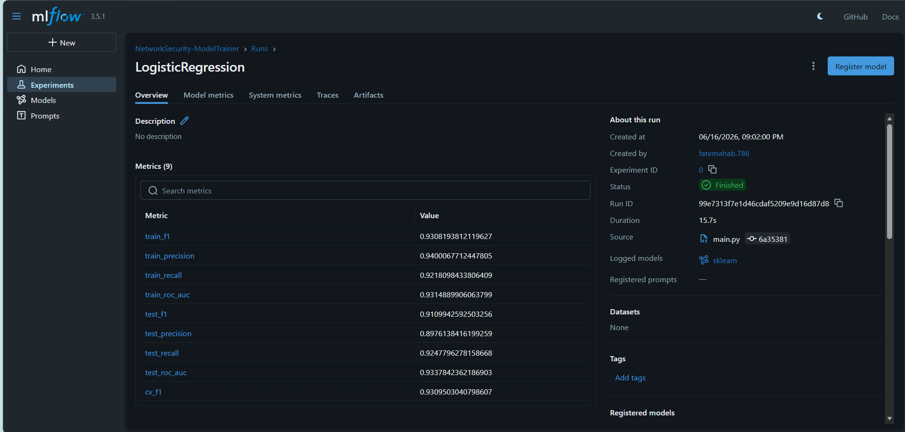
</p>

### 6.3 Random Forest — Metrics

The Random Forest model showed a substantial improvement over the linear baseline, with high recall on the test set.

<p align="center">
  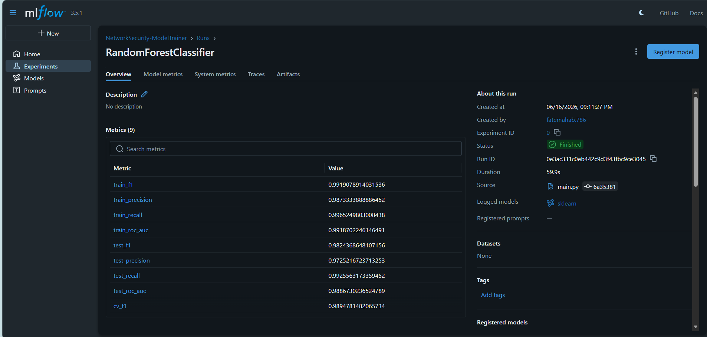
</p>

### 6.4 XGBoost — Metrics

XGBoost achieved the strongest test F1-score with the smallest train-test gap of the three models and was promoted as the production champion. XGBoost fits the network security domain particularly well: it captures complex, non-linear relationships in tabular flow data while remaining fast enough at inference time to support near-real-time classification.

<p align="center">
  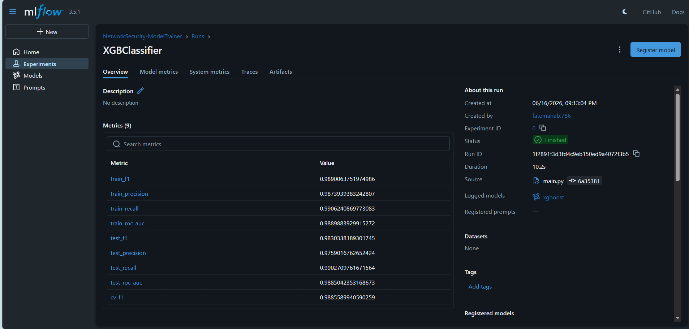
</p>

### 6.5 Model Comparison

The three models were compared side by side on F1-score, Precision, Recall, and ROC-AUC as part of the champion-challenger evaluation. The training log summary, a bar chart comparison, and an MLflow parallel coordinates plot each present this comparison from a different angle.

<p align="center">
  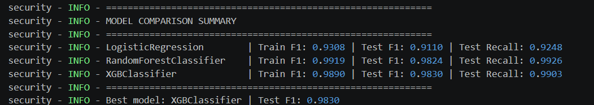
</p>

<p align="center">
  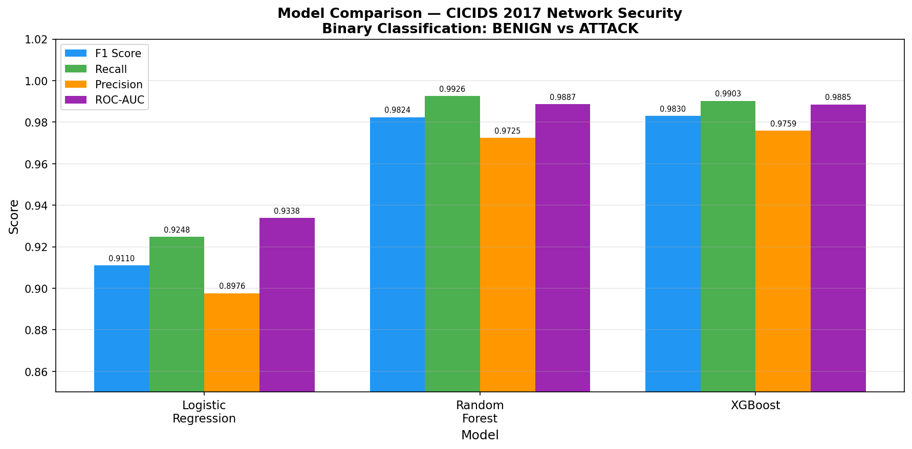
</p>

<p align="center">
  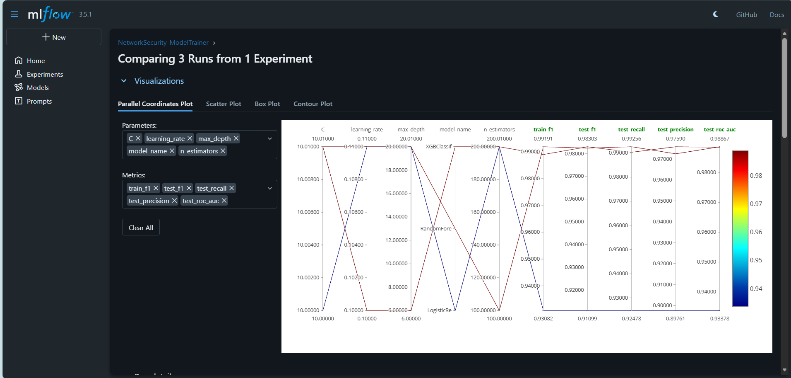
</p>

### 6.6 SHAP Feature Importance

The SHAP summary plot below shows the global feature importance for the deployed XGBoost model. `Bwd Packet Length Max` emerges as the dominant signal, consistent with the role of large backward packets in data exfiltration and certain denial-of-service response patterns.

<p align="center">
  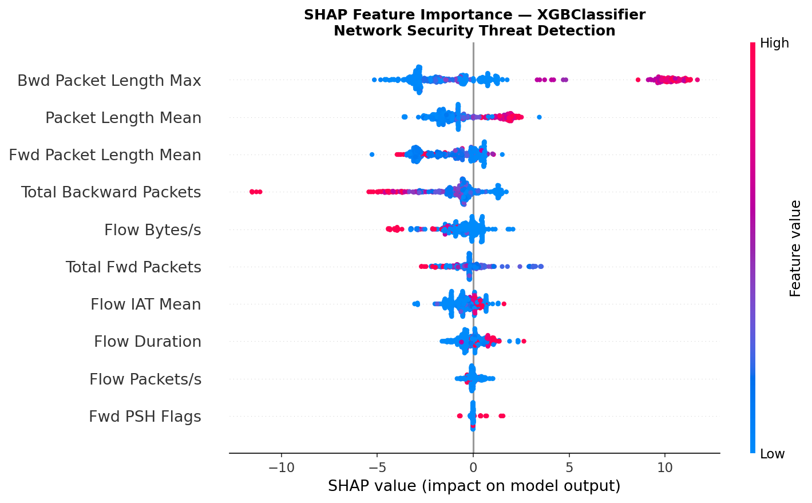
</p>

### 6.7 Dashboard — Benign Prediction

The deployed dashboard classifies a benign network flow with high confidence and no threat indicators surfaced.

<p align="center">
  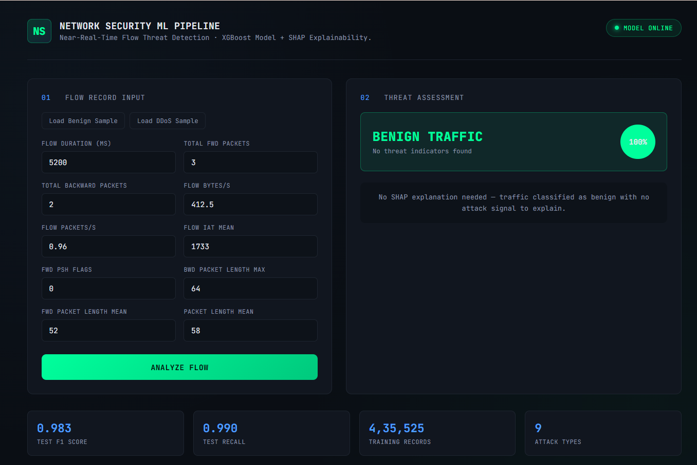
</p>

### 6.8 Dashboard — Attack Prediction

When a malicious flow is submitted, the dashboard flags it as an attack and renders the top contributing SHAP features as an animated bar chart, giving an analyst immediate insight into the basis for the classification.

<p align="center">
  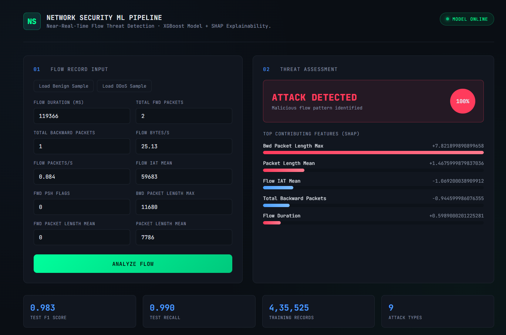
</p>

---

## 7. Key Challenges

- **Storage-constrained data engineering**: CICIDS 2017's full feature set exceeded MongoDB Atlas's free-tier storage limit, requiring careful feature selection and stratified sampling to retain attack-type diversity within the available quota.
- **Implementing SHAP explainability in a containerized production environment**: integrating model-specific SHAP explainers (TreeExplainer vs. LinearExplainer) into a FastAPI service running inside Docker, while keeping inference latency low enough for near-real-time use.
- **Ensuring train-inference consistency**: guaranteeing that the exact preprocessing pipeline (imputer and scaler) fitted during training is the same object loaded and applied at inference time, to prevent silent data leakage or mismatched scaling in production.

---

## 8. Live Demo & Walkthrough Screenshots 

> A live prototype of the API is available upon request — the EC2 instance is not kept running continuously in order to manage AWS costs. Reach out via the contact details below for a live walkthrough.

<p align="center">
  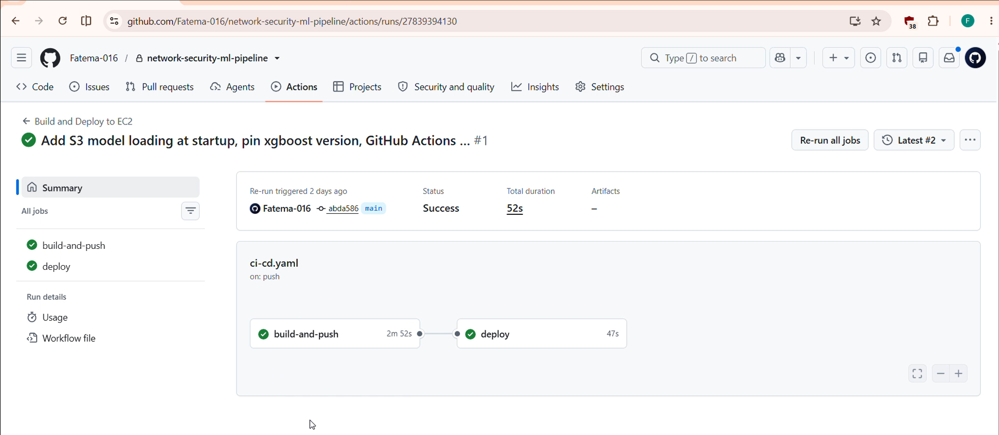
</p>

<p align="center">
  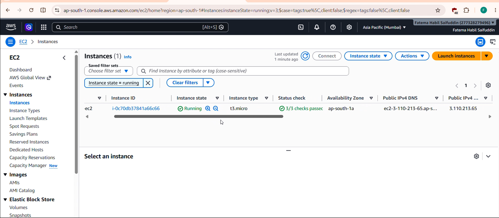
</p>

<p align="center">
  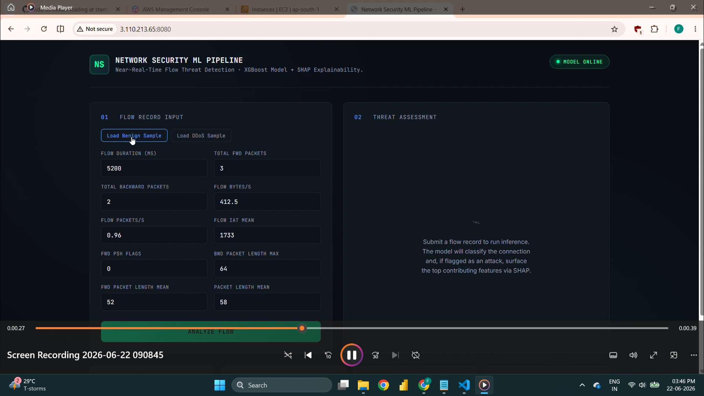
</p>

The video shows the GitHub Actions pipeline completing both the build-and-push and deploy stages successfully, followed by a walkthrough of the deployed application's user interface.

---

## 9. Acknowledgement

The project structure for this pipeline was adapted from the MLOps course architecture taught by **Krish Naik**, whose teaching on end-to-end machine learning pipeline design formed the foundation for this work. The dataset, customization choices, model comparison, explainability layer, and deployment architecture were independently implemented and extended for this project.

---

## 10. Author

**Name:** Fatema Habil Saifuddin

[](https://www.linkedin.com/in/fatema-habil-saifuddin/)
[](mailto:fatemahab.786@gmail.com)
